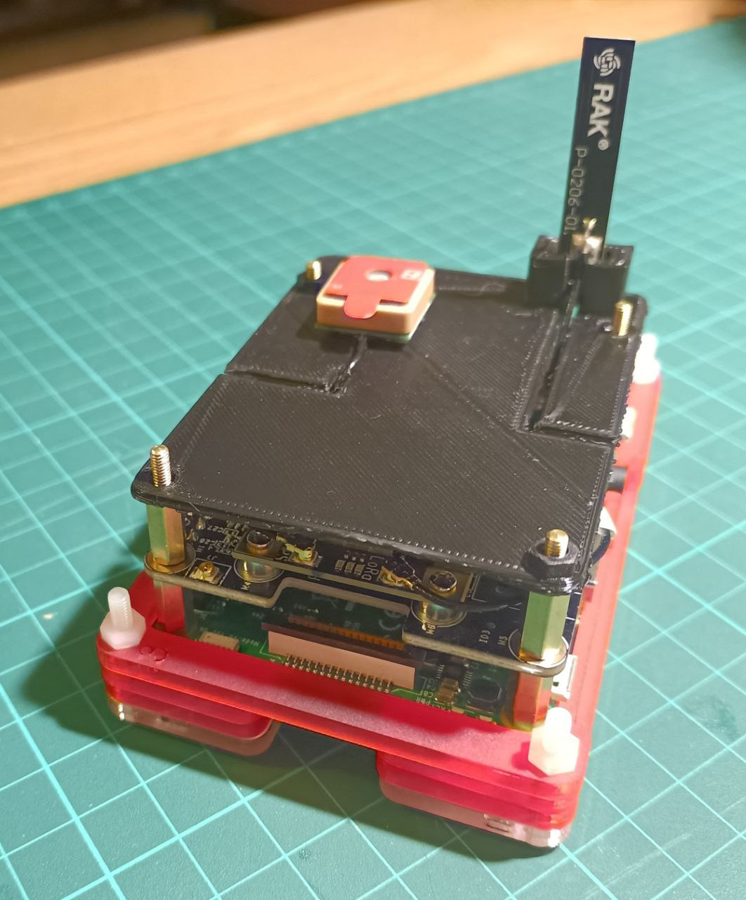
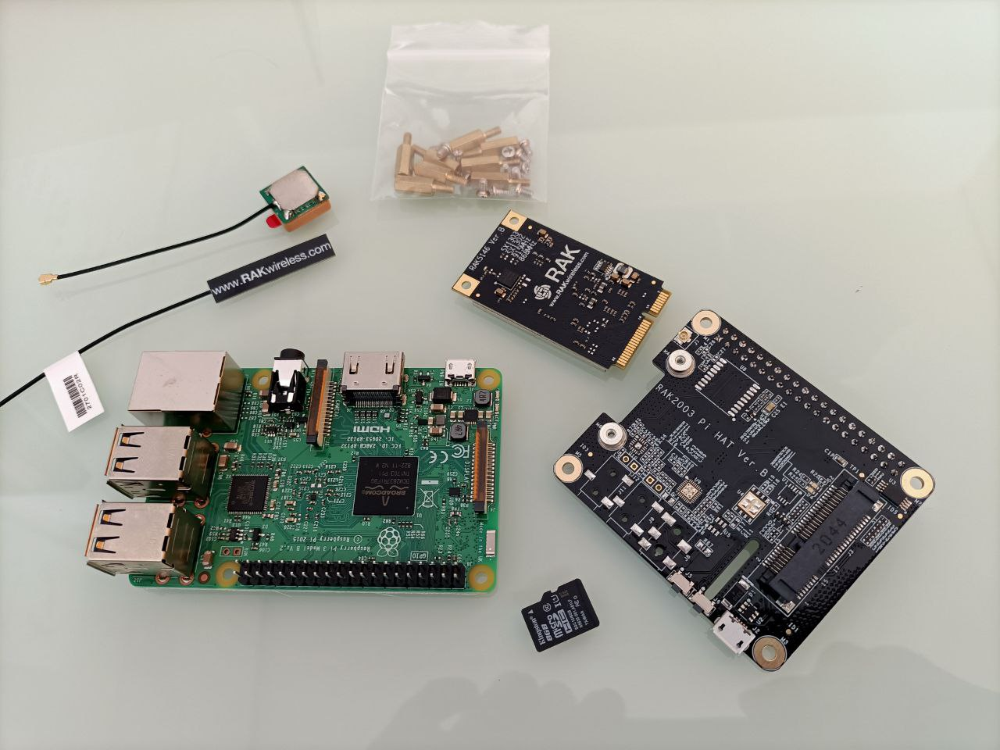
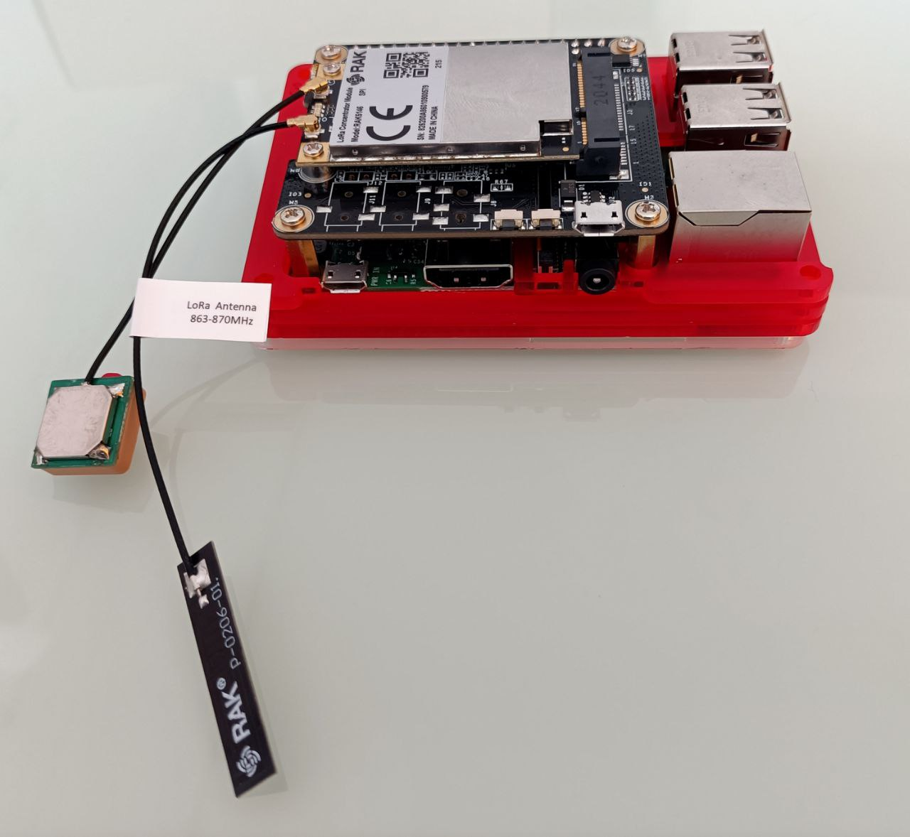

# LoRaWAN-Gateway - ChirpStark  Gateway OS



Istruzioni per la realizzazione di un Gateway LoRaWAN utilizzando il software __ChirpStark  Gateway OS__ e un __Raspberry Pi 3B__ con Hat __RAK5146__ (basato su __Semtech’s SX1303__).





La documentazione del sw è disponibile all'indirizzo https://www.chirpstack.io/docs/chirpstack-gateway-os/index.html


> Prima di procedere alla configurazioni di un gateway è necessario disporre di un __Network Server__. Senza di esso il gateway è di fatto inutile, in quanto il suo scopo è proprio quello di inoltrare i pacchetti LoRaWAN dei devices al server.


## Hardware

*   Raspberry Pi 3 Model B
*   RAK5146 Kit (https://store.rakwireless.com/products/rak5146-kit)
    *   RAK5146 SPI module powered by Semtech’s SX1303 baseband processor
    *   RAK5146/RAK2287 Pi HAT

### Documentazione RAK non utilizzata in questo contesto:
[https://docs.rakwireless.com/Knowledge-Hub/Learn/Raspberry-Pi-and-RAK-LPWAN-Concentrators](https://docs.rakwireless.com/Knowledge-Hub/Learn/Raspberry-Pi-and-RAK-LPWAN-Concentrators/)

## Installazione

Scaricato l'immagine v4.2.0 dal seguente link:

[https://www.chirpstack.io/docs/chirpstack-gateway-os/install/raspberry-pi.html](https://www.chirpstack.io/docs/chirpstack-gateway-os/install/raspberry-pi.html)

Eseguito flash della SD e avviato il raspberry collegato a rete ETH. Ottiene un suo IP via DHCP

Dopo il boot il gateway risulta raggiungibile da browser via https. Attraverso la sua interfaccia web è quindi possibile procedere alla configurazione.

Inoltre il gateway ha di default un server ssh attivo.

## Configurazione iniziale
Entrare la prima volta con utente `root` e password nulla.

### Administration

Per prima cosa impostare la password del gateway. Questa sarà la stessa usata anche per l'accesso ssh. 

*   Router Password → Set password


### Concentratord

*   Global config → Enabled Chip: **SX1302/SX1303**
*   SX1302/SX1303 Settings:
    *   Shield Model → RAK5146
    *   Channel-plan → EU868 - Standard channels
    *   GNSS → cheked

### MQTT Forwarder

* Topic prefix → eu868
* Server → tcp://<server_URL>:1883 

> i parametri successivi servono solo se lato server si stabiliscono regole per la sicurezza degli accessi. In produzione è senz'altro cosa buona proteggere l'accesso MQTT lato server, ma per i primi test possiamo evitare.


### UDP Forwarder

* Server → <server_URL>:1700 


### System

*   General Settings
    *   Hostname → FLRGW1
    *   Timezone → Europe/Rome


### Network

*   Interfaces
    *   lasciato LAN come DHCP Client
    *   lassciato lan6 non configurato
    *   lasciato wwan impostata di default come AP
*   Wireless
    *   Rinominato SSID: **ChirpStackAP-FLRGW1**
    *   Cambiato password WPA2-PSK (FLRLoRaAP\_001!)

> Non configurato per ora Routing, DHCP&DNS, Firewall


## Conclusioni

Se la configurazione è andata a buon fine e la comunicazione SPI con il modulo RAK funziona, comparirà il __GatewayID__ nel footer della pagina web (da quel che ho capito è una sorta di MAC Address proprio del modulo).

Una volta configurato il gateway occorre andare sulla dashboard del __Network Server__ ed aggiungerlo, indicandone l'ID univoco.

Se tutto va a buon fine, dopo poco il gateway notificherà lo stato online al server, riportando anche la posizione ottenuta dal modulo GPS del RAK.

> A livello di debug dei pacchetti dei device direttamente sul gateway non ho ancora trovato documentazione. La funzionalità del gateway risulta quindi essere molto trasparente.


## Note e approfondimenti

L'immagine rasp esegue 2 processi principali di chirpstack:

```text-plain
1657 root     21992 S    /usr/bin/chirpstack-concentratord-sx1302 -c /var/etc/chirpstack-concentratord/concentratord.toml -c /var/etc/chirpstack-concentratord/region.toml -c /var/etc/chirpstack-concentratord/channels.toml
 2558 root     20780 S    /usr/bin/chirpstack-mqtt-forwarder -c /var/etc/chirpstack-mqtt-forwarder/chirpstack-mqtt-forwarder.toml
```

Il demone **concentratord** utilizza quindi un file di configurazione in  `/var/etc/chirpstack-concentratord/concentratord.toml`

Anche le configurazioni su file `./toml` di regione e canali sono nella stessa directory.

